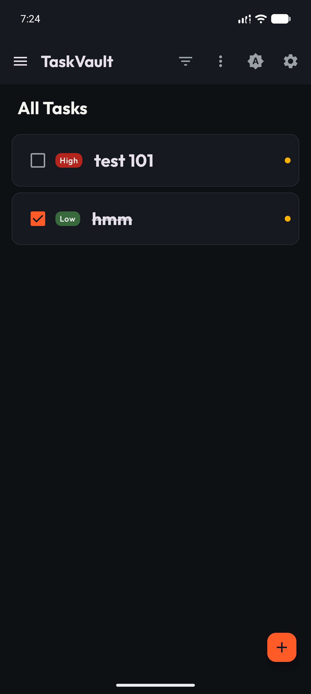
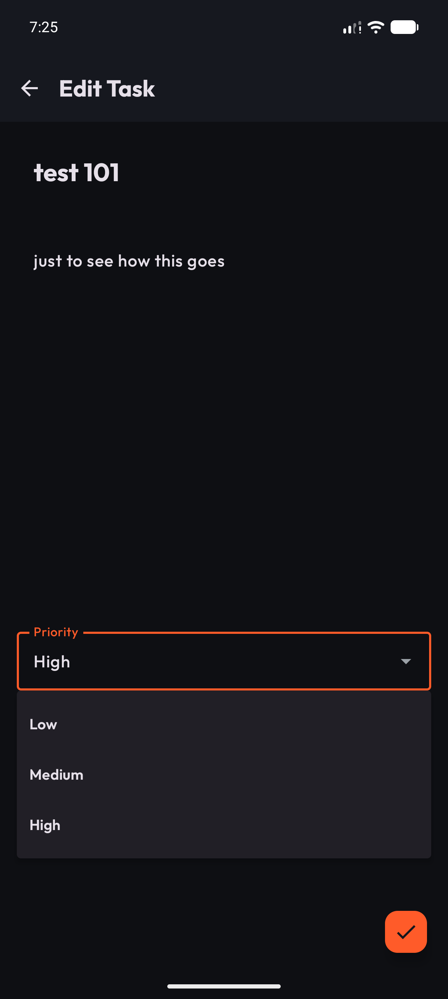
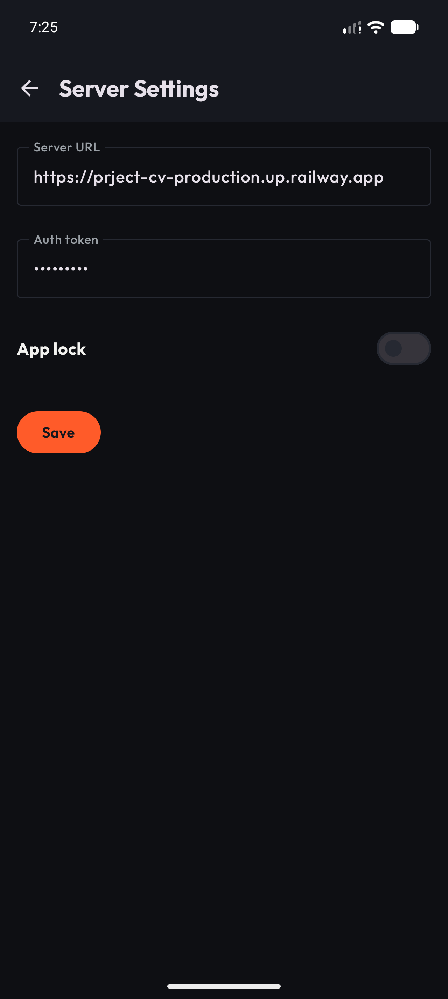
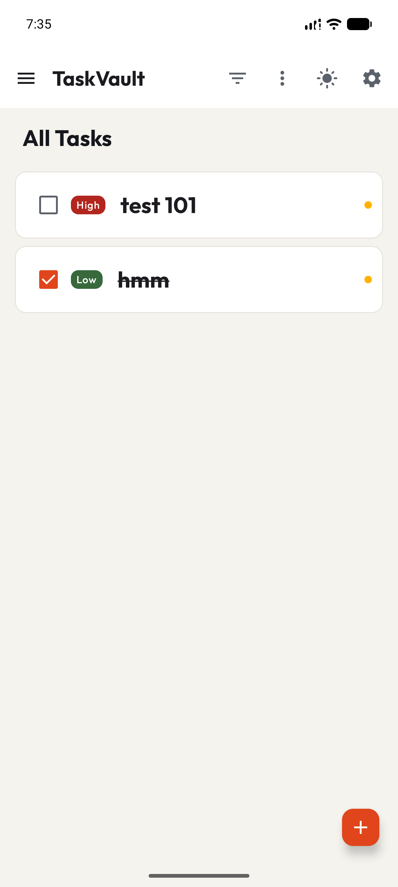

# TaskVault

[](https://github.com/boudy04/taskvault/actions/workflows/ci.yml)

An offline-first Android client for my own FastAPI REST API deployed on [Railway](https://railway.app). Create, edit, complete, and prioritize tasks locally; changes sync to the server when connectivity allows.

The app is built on top of [android/architecture-samples](https://github.com/android/architecture-samples) (single-activity Compose TODO app), which is Copyright The Android Open Source Project and licensed under the Apache License 2.0. TaskVault keeps that skeleton (navigation, task list/detail/add-edit structure, shared test setup) and replaces the fake data layer with Room + Retrofit against a real backend.

## Features

- **Offline-first mutation queue** — every create/edit/complete/delete is queued locally and replayed by a [WorkManager](https://developer.android.com/topic/libraries/architecture/workmanager)-driven `SyncEngine`
- **Room as source of truth** — the UI always reads from the local database, never blocking on the network
- **Last-write-wins reconcile** — pull/merge resolution against the server, with per-task sync badges in the list
- **Dynamic server settings** — base URL and bearer token editable in-app (Settings screen), persisted with DataStore
- **Dark / light / system theming** with a portfolio palette (Outfit typeface, orange accent)
- **Pill minimal UI** — priority chips, quiet surfaces, no clutter
- **Optional biometric app lock** — lock the app behind fingerprint/credential auth (enable in Settings)
- **Glance home widget** — glanceable task count on the home screen
- **Connectivity-failure notifications** — the user is told when a sync cannot reach the server instead of failing silently

## Architecture

```
Compose (UI) → ViewModel → Repository → Room + PendingOps → WorkManager (SyncEngine) → Retrofit → Railway (FastAPI)
```

The repository exposes `Flow`-based reads straight from Room; writes go to Room *and* a pending-ops queue. A periodic + on-demand `SyncEngine` worker drains the queue over Retrofit, then reconciles the server response back into Room (last write wins).

## How to run

1. Install [Android Studio](https://developer.android.com/studio) with **JDK 17+**
2. Clone and open the project:
   ```
   git clone https://github.com/boudy04/taskvault.git
   ```
3. Build and install on a device/emulator:
   ```
   .\gradlew installDebug
   ```
4. Open **Settings** in the app and enter your server URL and bearer token (the token field is masked). Without them the app runs fully offline and queues everything.

## Testing

```
.\gradlew testDebugUnitTest        # 60 unit tests
.\gradlew connectedDebugAndroidTest  # instrumented tests (CI runs them on an emulator)
.\gradlew lintDebug
```

Key suites: `SyncEngineTest` (queue drain + reconcile), `OfflineFirstRepositoryTest` (local-first reads/writes), `DataStoreSettingsRepositoryTest` (settings persistence), `WidgetStateTest` (Glance widget state).

## Screenshots

| Task list (dark) | Edit task + priority |
| --- | --- |
|  |  |
| **Server settings** | **Task list (light)** |
|  |  |

## License

```
Copyright 2024 The Android Open Source Project (android/architecture-samples baseline)

Licensed under the Apache License, Version 2.0 (the "License");
you may not use this file except in compliance with the License.
You may obtain a copy of the License at

    http://www.apache.org/licenses/LICENSE-2.0

Unless required by applicable law or agreed to in writing, software
distributed under the License is distributed on an "AS IS" BASIS,
WITHOUT WARRANTIES OR CONDITIONS OF ANY KIND, either express or implied.
See the License for the specific language governing permissions and
limitations under the License.
```

The [Outfit](https://fonts.google.com/specimen/Outfit) typeface is used under the SIL Open Font License (license text shipped in-app at `res/raw/ofl_outfit_font_license.txt`).
